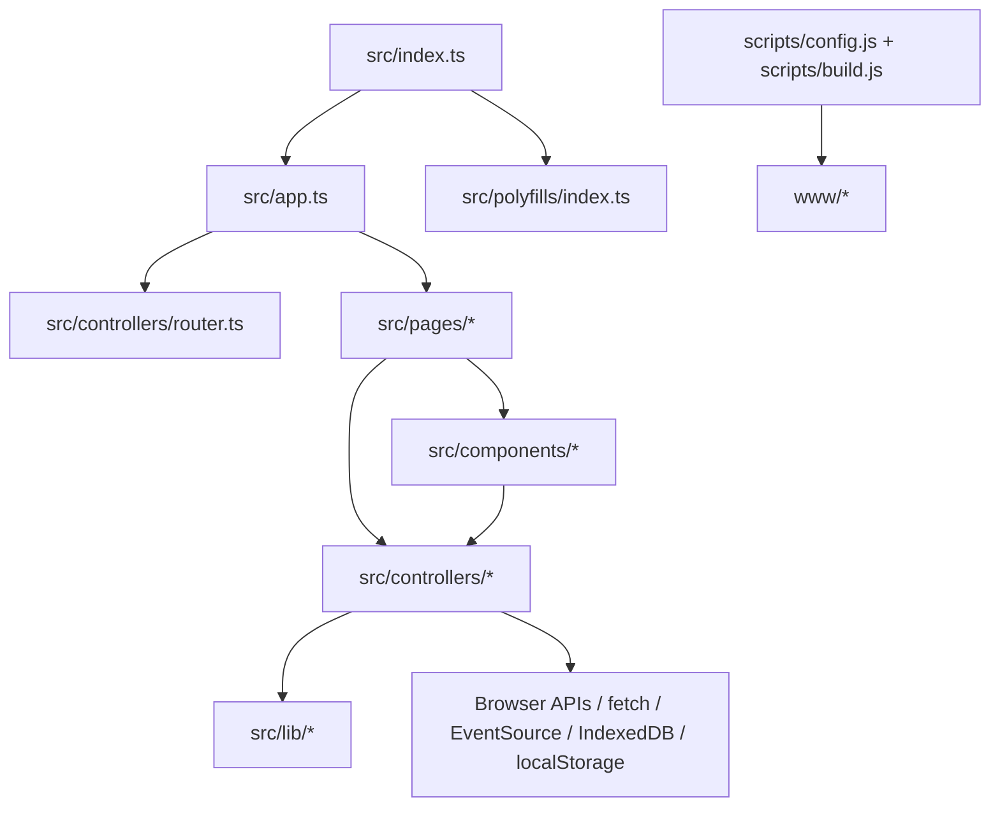

# Frontend Architecture

This document is the detailed frontend architecture reference.

Read it when working on:

- application structure
- routing
- controllers
- shared state
- persistence
- async behavior
- browser integrations
- code splitting
- platform APIs
- polyfills
- architectural refactors

It is not intended to be loaded for every small frontend change.

## Runtime Model

The project deliberately avoids a heavyweight application framework.

Its internal frontend framework is built from:

- esbuild
- Lit + Custom Elements
- `@lit-labs/signals`
- Navigation API + `URLPattern`
- native browser APIs
- targeted centrally loaded polyfills

The application should stay platform-shaped rather than recreate browser capabilities behind project-specific framework layers.

## Application Boot

### `src/index.ts`

The runtime entrypoint is intentionally small.

Responsibilities:

- load polyfills
- register the service worker
- load shared icons
- import the application

Do not move domain initialization or screen behavior into this module.

### `src/app.ts`

`src/app.ts` is the application composition root.

Responsibilities include:

- route registration
- auth/access guards
- route preload relationships
- lazy page imports
- global UI such as `NavBar`
- connection between the router and root container

If behavior concerns which screen loads, under what conditions, or what should preload with it, it normally belongs here or in the router.

## Route Model

The application is an SPA with route-level code splitting.

Route resolution is handled by the custom router.

Pages are loaded with dynamic `import()`.

Heavy domain dependencies should normally be awaited at the route boundary before the page is instantiated.

Preferred shape:

```ts
content: async () => {
	const { default: Page } = await import('./pages/example/index.ts')
	await ledger.ready

	return new Page()
}
```

The exact syntax should follow surrounding repository code.

The architectural rule is more important than the example:

- import only the route being entered
- await only the domain dependencies that route needs
- avoid global up-front initialization without a concrete reason
- avoid hiding major startup work inside arbitrary component lifecycle hooks

Preload relationships should represent likely navigation paths, not speculative loading of the entire app.

## Layer Model



Preferred dependency direction:

```text
pages -> controllers / components / lib
components -> controllers / lib
controllers -> lib / platform APIs
```

Controllers must not depend on page modules.

Build scripts must not depend on runtime UI modules.

## Controllers

`src/controllers/*` is the domain/service layer.

Controllers own:

- domain state
- external IO
- authorization-related behavior
- protocol details
- browser integrations with durable app meaning
- persistence coordination
- caches whose lifetime exceeds one page

The existing pattern is one long-lived exported controller instance per domain.

Typical controller structure:

- private mutable signals
- public derived getters
- validated setters when mutation is exposed
- explicit async operations
- hidden initialization through `ready` or controller startup
- transport/protocol details kept with the domain that owns them

Examples of existing ownership:

- `api.ts` -> authenticated HTTP and `EventSource`
- `profile.ts` -> account/auth bootstrap and logout
- `ledger.ts` -> assets, balances, transactions, currency/region state
- `env.ts` -> application-facing environment integrations
- `db.ts` -> IndexedDB cache access

Controllers are long-lived. They should not accumulate unbounded historical state merely because they survive navigation.

## Pages

`src/pages/*` contains route targets.

A page owns one screen.

Pages may:

- assemble screen structure
- consume controller state
- trigger controller operations
- own genuinely temporary UI state
- coordinate screen-local transitions
- choose conditional presentation

Pages should not:

- reproduce domain normalization
- duplicate controller caching
- implement transport protocols
- become an alternate source of truth
- own durable state used by multiple screens

If logic remains meaningful after the page disappears, it probably belongs below the page layer.

## Components

`src/components/*` packages reusable UI and interactions.

Good candidates include:

- selectors
- dialogs
- notification UI
- transaction rows/details
- input primitives
- OTP flows
- slide-submit interactions

Prefer inputs/properties plus events for components intended to stay domain-independent.

A component may read a controller directly when it is intentionally app/domain-aware. Make that choice explicitly rather than accidentally coupling a generic component to application state.

## Lib

`src/lib/*` contains small infrastructure and framework glue.

Examples:

- custom-element helpers
- open-DOM helpers
- i18n
- icon infrastructure
- narrow generic helpers

Keep `lib` small.

Do not move domain logic into `lib` merely because more than one feature needs it. Shared domain behavior still belongs to the owning controller.

## State Model

Authoritative reactive state shared by screens belongs in controller signals.

Typical pattern:

```ts
#value = new Signal.State(initial)

get value () {
	return this.#value.get()
}

set value (value) {
	this.#value.set(validate(value))
}
```

Consumers use `SignalWatcher(...)` where reactive Lit rendering is required.

The project should not gain a second generic store framework while this model remains sufficient.

Events are appropriate for actual events. They should not become a disguised second state system.

## Persistence

Use persistence according to data lifetime and authority.

Preferred hierarchy:

- controller state -> runtime source of truth
- backend API -> authoritative external source
- IndexedDB -> structured local cache
- `localStorage` -> small preferences and session/route-adjacent flags

Avoid arbitrary feature-local caches when an existing persistence layer already fits.

Do not persist sensitive data merely because storage is convenient.

## Async Ownership

Every async operation needs an owner.

Possible owners include:

- controller
- route
- component

The owner determines cancellation and stale-result behavior.

When multiple invocations may overlap:

- cancel older work where cancellation is meaningful
- otherwise tag/version requests and ignore stale results
- do not allow an old response to overwrite newer state

Make behavior explicit for:

- retries
- deduplication
- optimistic updates
- rollback
- offline state
- user cancellation

Avoid detached async work with no observable ownership.

## Error Model

Classify errors by behavior rather than one generic failure path when the distinction affects UX or state.

Useful categories include:

- validation
- authentication/authorization
- transient network/server
- offline
- user-cancelled
- fatal/unrecoverable

Do not add elaborate error taxonomies where behavior does not differ.

## Navigation

Use Navigation API consistently for in-app navigation.

Prefer:

```ts
navigation.navigate(...)
```

Route interception remains owned by the custom router.

Do not add a parallel `history.pushState` router or another SPA routing abstraction.

Use route entry guards for access policy and redirects.

## Modern Platform Policy

Target the latest viable platform instead of designing for old-platform compatibility first.

Use this order:

1. latest stable native capability
2. serious near-standard proposal with an appropriate API shape
3. polyfill matching that native/proposed shape
4. project-specific abstraction only if no platform-shaped solution fits

This allows application code to converge toward the platform rather than maintain permanent compatibility architecture.

Examples already aligned with this direction include:

- Navigation API
- `URLPattern`
- View Transitions
- `<dialog>`
- native storage APIs

Before introducing a library for a browser capability, verify whether modern browser APIs already solve it.

## Polyfills

All compatibility loading belongs in:

```text
src/polyfills/index.ts
```

Feature modules should normally use the target API directly.

The central polyfill layer should:

- feature-test at runtime
- load only where native support is missing
- expose the native/proposal-shaped API
- become effectively free once browser support reaches the deployment target

Do not scatter:

```ts
if ('someFeature' in window) ...
```

through unrelated feature modules when the compatibility problem can be resolved centrally.

## DOM Boundary Architecture

DOM boundary choice is a component-contract decision.

### Prefer light/open DOM when

- the component belongs to the application
- it should naturally inherit app typography and styles
- surrounding layout should see its document structure
- hard encapsulation provides no concrete benefit

Pages and ordinary feature UI normally belong here.

Use existing open-DOM helpers rather than creating a second mechanism.

### Prefer shadow DOM when

- slots are part of the public API
- internal styling must be protected
- surrounding page CSS must not be able to break internal structure
- the widget may be extracted from the application
- a controlled external styling surface through custom properties, `::part`, or `::slotted` is desirable

Shadow DOM is not the default simply because Custom Elements support it.

## Accessibility

Accessibility constraints should affect implementation choices from the start.

Use semantic native elements whenever they already provide the needed behavior.

Custom interactive UI must retain:

- keyboard operation
- appropriate focus behavior
- accessible names/descriptions
- status announcements where relevant
- compatibility with zoom and input modality
- reduced-motion behavior

Dialogs, transient overlays, route transitions, and popovers require deliberate focus handling.

Do not replace a native control with a div-based recreation without a concrete reason.

## Security and Privacy

Frontend design must assume client-visible data can be inspected.

Therefore:

- minimize persisted sensitive information
- do not log credentials, tokens, PII, or secrets
- redact external payloads where logging is genuinely required
- validate origins in cross-window/message interactions
- use safe DOM insertion and URL APIs
- request permissions only for the narrow capability needed
- keep clipboard, camera, and file access explicit

Third-party code introduces a trust boundary. Add dependencies only when their value exceeds what the platform or existing code can provide.

## Performance

Performance decisions belong in architecture, not only regression cleanup.

Consider:

- route chunk size
- preload value
- cache lifetime
- controller retention
- list rendering cost
- media loading
- layout/animation frequency
- high-frequency input paths

Do not preload or retain data merely because it may eventually be useful.

## Build System

`scripts/*` owns build behavior.

Current responsibilities include:

- esbuild configuration
- CSS module handling
- static asset copying
- env injection
- chunking
- clean build
- `.well-known` output

`www/*` is generated output.

Never use generated files as the source of runtime behavior changes.

## Architectural Decision Checklist

Before placing new logic, ask:

- changes which screen loads? -> router/app
- changes domain data or IO? -> controller
- changes one screen's presentation? -> page
- reusable interaction? -> component
- infrastructure glue? -> lib
- browser compatibility? -> polyfill/bootstrap

Before adding new infrastructure, search for an existing:

- controller
- helper
- signal
- component
- platform primitive
- polyfill mechanism

Prefer extending a stable contract over creating a parallel one.

If a public contract must change, make the migration explicit rather than silently repurposing its meaning.

